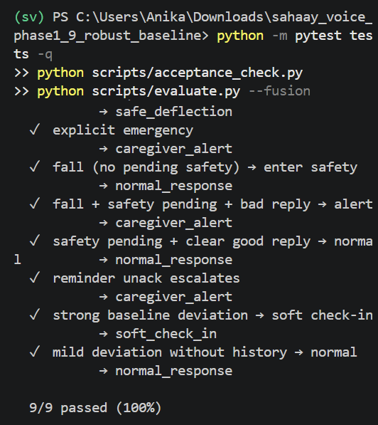
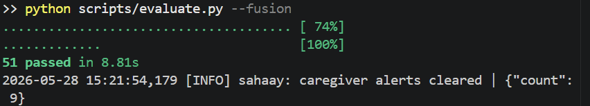
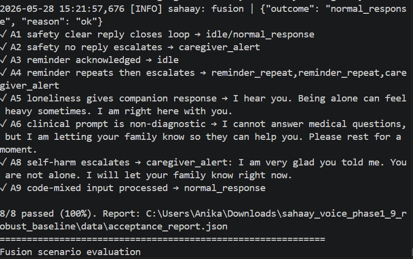
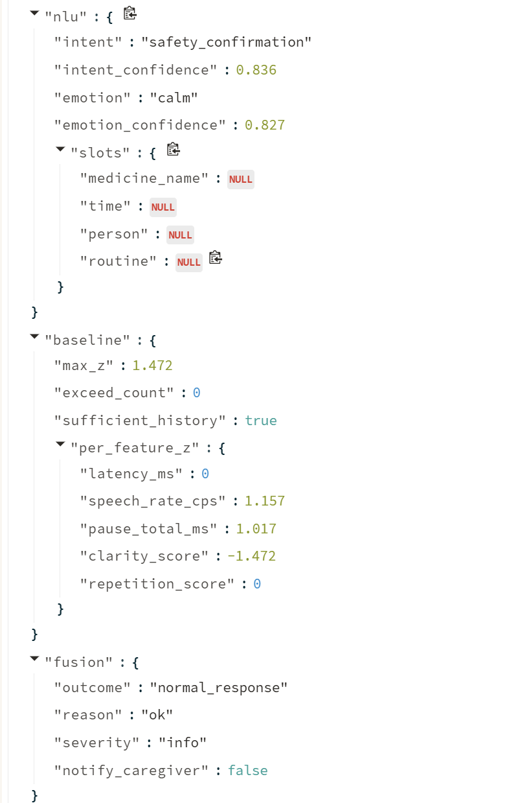
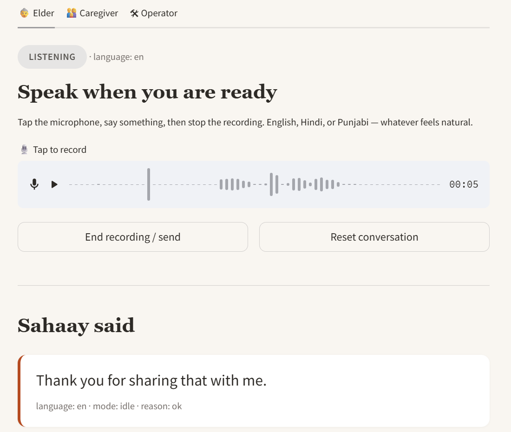
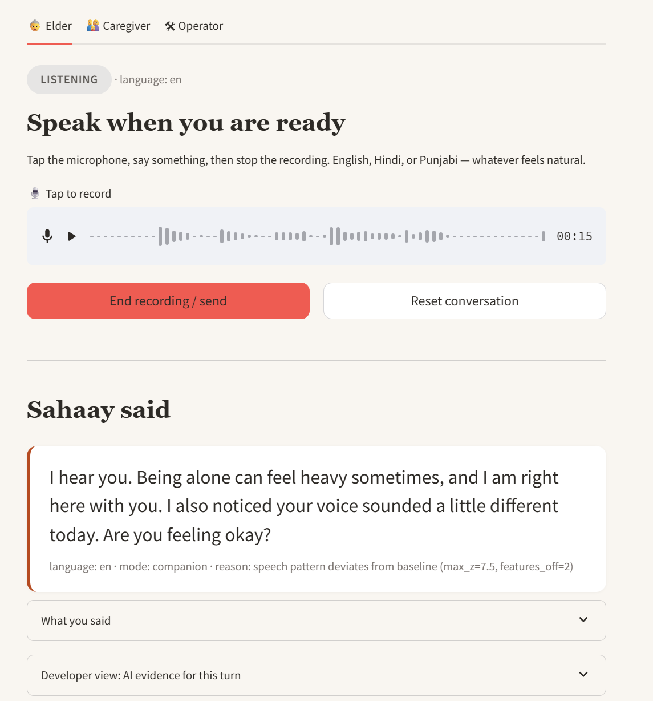
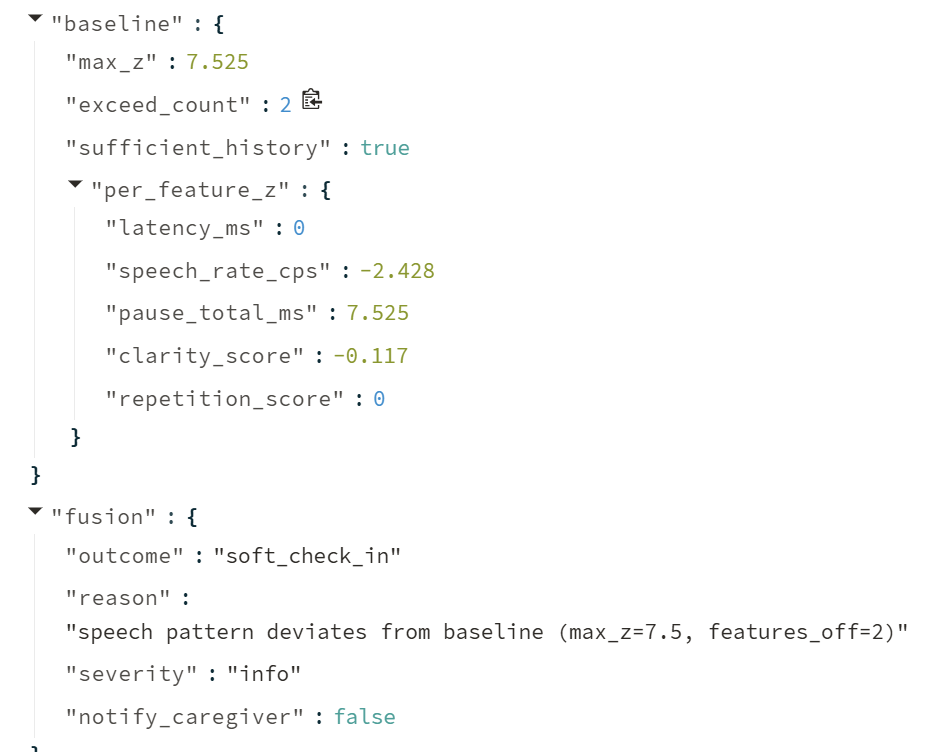

# Sahaay Voice

## An Explainable Multilingual Speech-NLP Layer for Elder Safety, Companionship, and Memory Support

Sahaay Voice is a multilingual voice-based elder-care software prototype that combines speech recognition, speech-behavior analysis, natural language understanding, personal-baseline monitoring, simulated wearable events, and rule-based caregiver escalation.

This project is **not a simple chatbot**. It is designed as an **explainable speech-NLP safety layer** for elderly users, where every response is backed by structured AI evidence such as ASR confidence, speech clarity, pause burden, NLU intent, emotional state, baseline deviation, and fusion outcome.

> **Important:** Sahaay Voice is **not a medical device** and does **not diagnose** stroke, dementia, depression, heart attack, or any medical condition. Clinical-style prompts are safely deflected and routed to caregiver notification.

---

## Project Motivation

Elderly individuals living at home may face three overlapping challenges:

1. **Safety risks** such as falls, unclear speech, confusion, or delayed response.
2. **Loneliness and emotional isolation**, especially when caregivers are away.
3. **Memory-related support needs**, including reminders for medication, hydration, meals, or routine activities.

Most existing voice assistants are not designed for elderly Indian users, multilingual code-mixed interaction, personal speech-baseline monitoring, or caregiver escalation. Sahaay Voice addresses this gap through a local, explainable, safety-first prototype.

---

## Core Idea

Sahaay Voice listens to the elder, understands the spoken input, analyzes speech behavior, compares the speech pattern against a personal baseline, combines it with simulated wearable safety signals, and decides whether to:

* respond normally,
* provide companionship,
* repeat a reminder,
* ask a gentle wellness check-in,
* safely deflect a clinical question,
* or notify a caregiver.

The system supports:

* English
* Hindi
* Punjabi
* Code-mixed speech

---

## Key Features

### 1. Multilingual Voice Interaction

The system accepts spoken input and transcribes it using a multilingual ASR pipeline.

**ASR engine:** `faster-whisper medium`
**Runtime:** CUDA/float16 on RTX 4070 when available

---

### 2. Speech Feature Extraction

For each voice turn, the system computes speech-level indicators including:

* speech duration,
* voiced duration,
* pause burden,
* internal pause count,
* speech rate,
* voice activity ratio,
* ASR confidence,
* clarity score,
* repetition accuracy during safety prompts.

These features are used for personal-baseline comparison and safety reasoning.

---

### 3. Natural Language Understanding

The NLU layer classifies elder utterances into elder-care intents such as:

* `safety_confirmation`
* `emergency_help`
* `clinical_question`
* `self_harm_risk`
* `loneliness_expression`
* `confusion_or_disorientation`
* `medicine_query`
* `reminder_request`
* `task_acknowledgement`
* `caregiver_request`
* `casual_chat`

The system also estimates a coarse emotional state such as calm, sad, anxious, or confused.

---

### 4. Personal Baseline Monitoring

Sahaay Voice maintains a local baseline of the elder’s normal speech pattern. After calibration, new utterances are compared against the baseline using feature-level z-scores.

Example:

```text
Normal calibrated speech
→ max_z < 2
→ normal_response

Slow / pause-heavy abnormal speech
→ max_z ≈ 7.5
→ soft_check_in
```

This allows the system to detect abnormal speech-response patterns without claiming a medical diagnosis.

---

### 5. Simulated Wearable Safety Feed

Hardware is outside the scope of this prototype. Instead, the Operator panel simulates wearable events such as:

* fall detected,
* inactivity,
* abnormal motion,
* normal event.

These simulated signals are fused with speech and NLU outputs to trigger Safety Mode or caregiver alerts.

---

### 6. Safety Mode

Safety Mode is entered when the system detects a fall event, emergency phrase, or abnormal speech pattern.

Example prompt:

```text
Are you okay? Please say, I am okay.
```

If the elder confirms clearly, the system returns to normal monitoring.
If the elder does not reply, replies unclearly, or gives an off-target answer, a caregiver alert is generated.

---

### 7. Companion Mode

Companion Mode provides warm, dignified responses to routine or loneliness-related speech.

Example user input:

```text
I feel lonely today.
```

Example response:

```text
I hear you. Being alone can feel heavy sometimes. I am right here with you.
```

If loneliness is accompanied by abnormal speech deviation, the response becomes a gentle companion + soft check-in.

---

### 8. Memory Support Mode

Memory Mode delivers caregiver-approved reminders and waits for acknowledgement.

Examples of acknowledgement:

```text
done
I took it
ho gaya
dawai le li
```

If a reminder is not acknowledged after repeated attempts, the caregiver panel is notified.

---

## System Architecture

```text
Microphone Audio
      ↓
Audio Capture / Recording
      ↓
Multilingual ASR
      ↓
Speech Feature Extraction
      ↓
NLU: Intent + Emotion + Slots
      ↓
Personal Baseline Comparator
      ↓
Simulated Wearable Feed
      ↓
Fusion and Escalation Engine
      ↓
Dialogue Manager
      ↓
Response Generator
      ↓
Elder Interface / Caregiver Panel / Operator Panel
```

---

## Explainable AI Evidence

Every processed turn produces a structured evidence object. This makes the system auditable and report-ready.

Example evidence fields:

```json
{
  "asr": {
    "transcript": "I feel lonely today",
    "detected_language": "en",
    "approx_confidence": 0.64
  },
  "speech_features": {
    "speech_rate_cps": 12.65,
    "clarity_score": 0.78,
    "pause_total_ms": 2320
  },
  "nlu": {
    "intent": "loneliness_expression",
    "emotion": "sad"
  },
  "baseline": {
    "max_z": 7.5,
    "exceed_count": 2,
    "sufficient_history": true
  },
  "fusion": {
    "outcome": "soft_check_in",
    "notify_caregiver": false
  }
}
```

---

## Evaluation Results

The project was evaluated using automated tests, scripted PRD acceptance checks, fusion decision scenarios, and a controlled NLU benchmark.

| Evaluation Component              |       Result |
| --------------------------------- | -----------: |
| Automated unit tests              | 51/51 passed |
| PRD acceptance scenarios          |   8/8 passed |
| Fusion and escalation scenarios   |   9/9 passed |
| Controlled NLU benchmark examples |           66 |
| NLU intent classes                |           11 |
| Controlled NLU benchmark accuracy |        1.000 |
| Controlled NLU macro-F1           |        1.000 |
| Safety-critical intent recall     |        1.000 |

The controlled NLU benchmark validates the prototype’s routing behavior on curated project-specific examples. It should not be interpreted as population-level real-world generalization.

---

## Safety-Critical NLU Intents

The following safety-critical intents were explicitly evaluated:

| Intent                | Purpose                                         |
| --------------------- | ----------------------------------------------- |
| `safety_confirmation` | Confirms elder is okay during Safety Mode       |
| `emergency_help`      | Detects explicit help-seeking                   |
| `clinical_question`   | Deflects diagnosis-seeking prompts              |
| `self_harm_risk`      | Escalates severe distress or self-harm language |

---

## PRD Acceptance Scenarios

| Scenario                            | Result |
| ----------------------------------- | -----: |
| Safety clear reply closes loop      | Passed |
| Safety no reply escalates           | Passed |
| Reminder acknowledged               | Passed |
| Reminder repeats then escalates     | Passed |
| Loneliness gives companion response | Passed |
| Clinical prompt is non-diagnostic   | Passed |
| Self-harm escalates                 | Passed |
| Code-mixed input processed          | Passed |

---

## Screenshots and Evidence

### 1. PRD Acceptance Scenarios



**Figure 1:** PRD acceptance scenarios showing end-to-end validation of Safety, Memory, Companion, clinical deflection, self-harm escalation, and code-mixed input handling.

---

### 2. Unit Testing



**Figure 2:** Automated unit test output showing 51/51 tests passed.

---

### 3. Fusion Scenario Evaluation



**Figure 3:** Fusion scenario evaluation showing decision-layer validation across normal response, caregiver alert, safe deflection, reminder escalation, and soft check-in outcomes.

---

### 4. Normal Speech AI Evidence



**Figure 4:** AI evidence for normal calibrated speech. The system shows sufficient baseline history, low deviation score, and normal response without caregiver escalation.

---

### 5. Normal Elder Interaction



**Figure 5:** Elder interface showing normal speech interaction and non-alerting system response.

---

### 6. Abnormal Speech Soft Check-in



**Figure 6:** Companion + soft safety check-in triggered after abnormal pause-heavy speech. The system responds supportively without immediately alerting the caregiver.

---

### 7. Abnormal Speech AI Evidence



**Figure 7:** Baseline evidence showing max_z ≈ 7.5 and fusion outcome `soft_check_in`, demonstrating personal-baseline-aware speech deviation detection.

---

## Installation

### 1. Clone the repository

```powershell
git clone https://github.com/anikasoni/sahaay-voice.git
cd sahaay-voice
```

### 2. Create virtual environment

```powershell
py -3.10 -m venv sv
.\sv\Scripts\Activate.ps1
```

### 3. Install CUDA PyTorch

```powershell
python -m pip install torch --index-url https://download.pytorch.org/whl/cu121
```

### 4. Install requirements

```powershell
python -m pip install -r requirements.txt
```

If `webrtcvad` fails on Windows:

```powershell
(Get-Content requirements.txt) -replace '^webrtcvad>=2.0.10','webrtcvad-wheels>=2.0.10' | Set-Content requirements.win.txt
python -m pip install -r requirements.win.txt
```

---

## Running the Application

```powershell
python -m streamlit run app/main.py --server.fileWatcherType none --server.runOnSave false
```

The app contains three panels:

| Panel     | Function                                                                 |
| --------- | ------------------------------------------------------------------------ |
| Elder     | Voice interaction interface                                              |
| Caregiver | Caregiver alert dashboard                                                |
| Operator  | Simulated wearable events, reminders, baseline controls, and AI evidence |

---

## Running Evaluations

### Unit tests

```powershell
python -m pytest tests -q
```

### PRD acceptance checks

```powershell
python scripts/acceptance_check.py
```

### Fusion evaluation

```powershell
python scripts/evaluate.py --fusion
```

### NLU benchmark

```powershell
python scripts/evaluate_nlu_dataset.py
```

### Final project metrics

```powershell
python scripts/final_project_report_metrics.py
```

---

## Baseline Calibration

The personal speech baseline can be calibrated from the terminal:

```powershell
python scripts/calibrate_microphone.py --n 10 --seconds 5
```

After calibration, the system should show:

```text
normal speech → normal_response
abnormal pause-heavy speech → soft_check_in
```

---

## Repository Structure

```text
sahaay-voice/
  app/
    main.py
    ui_elder.py
    ui_caregiver.py
    ui_operator.py
    ui_evidence.py

  core/
    asr.py
    features.py
    nlu.py
    baseline.py
    fusion.py
    dialogue.py
    response.py
    tts.py
    logger.py

  config/
    thresholds.yaml
    reminders.yaml
    prompts.yaml

  scripts/
    acceptance_check.py
    evaluate.py
    evaluate_nlu_dataset.py
    final_project_report_metrics.py
    calibrate_microphone.py

  tests/
    test_features.py
    test_nlu.py
    test_fusion.py
    test_dialogue.py

  data/
    nlu_eval.jsonl
    final_project_metrics.json
    final_project_metrics.csv

  report_assets/
    screenshots/
    metrics/

  README.md
  requirements.txt
```

---

## Ethical and Safety Boundary

Sahaay Voice follows a conservative safety posture:

* It does not diagnose medical conditions.
* It does not replace caregivers or clinicians.
* It does not perform real-world fall detection.
* Wearable events are simulated for prototype demonstration.
* Clinical-style prompts are routed to safe deflection and caregiver notification.
* Self-harm language is escalated to caregiver notification.
* Data is stored locally for the prototype.

---

## Limitations

1. The system is not clinically validated.
2. Real wearable integration is not implemented.
3. ASR WER is not reported because a labeled `.wav + transcript` dataset was not created.
4. The NLU benchmark is controlled and project-specific.
5. Punjabi ASR/TTS performance may vary.
6. The prototype is designed for demonstration and evaluation, not production deployment.

---

## Future Work

Future improvements include:

* Fine-tuning MuRIL or IndicBERT on a larger multilingual elder-care dataset.
* Creating a labeled ASR benchmark for English, Hindi, Punjabi, and code-mixed speech.
* Integrating real wearable sensor data.
* Adding a caregiver mobile app with push notifications.
* Improving Punjabi ASR/TTS quality.
* Testing with elderly speakers under approved ethical supervision.
* Adding long-term baseline drift handling.

---

## Project Information

**Project Title:** Sahaay Voice: An Explainable Multilingual Speech-NLP Layer for Elder Safety, Companionship, and Memory Support

**Submitted by:** Anika Soni
**Roll Number:** 102303912
**Team:** Individual Project
**Guide:** Dr. Jasmeet Singh / Dr. Simran Setia
**Institute:** Thapar Institute of Engineering and Technology

**Code Repository:**
https://github.com/anikasoni/sahaay-voice

---

## Disclaimer

This project is a software prototype created for academic demonstration. It is not a medical device, diagnostic system, emergency response system, or clinically validated healthcare tool.
